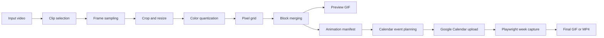

# destiny-calendar-animation

> Development status: local MVP, guarded Calendar calibration, resumable multi-frame upload, and manually authenticated browser capture.

`destiny-calendar-animation` turns a local video clip into a small, palette-limited pixel animation, a preview GIF, and a versioned JSON manifest. The manifest is suitable for safely planning a future experiment in which each frame is represented by one week of real Google Calendar events. The processor is generic; no Destiny assets are distributed here.



## What works

- video inspection for MP4, MOV, MKV, WebM, AVI, and readable GIF files;
- uniform clip sampling without loading the entire video;
- optional crop plus `contain`, `cover`, and `stretch` fitting;
- deterministic grayscale or Calendar-inspired palettes (2–6 colors);
- optional Euclidean background-color removal;
- horizontal runs merged into one block/event estimate;
- PNG frames, enlarged local GIF, source metadata, and schema `1.0` manifest;
- manifest validation and footprint estimates;
- experimental weekly Calendar mapping exported as a local dry-run plan.
- deterministic Calendar calibration patterns with JSON/text/PNG artifacts;
- opt-in OAuth upload of at most 30 calibration events by default to a dedicated lab calendar;
- duplicate-run detection and cleanup filtered by private metadata.
- structured color, position, horizontal-bar, and subcolumn-order observations with mapper-readiness summary.
- sparse and full-grid one-frame mapping, Calendar color mapping, local comparison artifacts, and guarded upload.
- immutable multi-frame plans with serial upload, frame checkpoints, partial recovery, and cleanup;
- manually authenticated Playwright week capture with resume plus local GIF/optional MP4 composition.

## Install

Python 3.12+ and MP4/H.264 input are recommended.

```bash
uv sync --extra dev
uv run calendar-anim --help
```

Compatible `pip` installation:

```bash
python -m venv .venv
# Activate .venv for your shell
python -m pip install -e ".[dev]"
calendar-anim --help
python -m calendar_anim --help
```

## CLI

Inspect metadata:

```bash
calendar-anim inspect input.mp4
```

Typical output includes dimensions, FPS, source-frame count, duration, codec, and warnings. Audio detection is intentionally reported as unavailable because audio is ignored.

Render a clip:

```bash
calendar-anim render input.mp4 \
  --start 0 --duration 2.5 --frames 10 \
  --width 28 --height 32 --colors 4 \
  --palette calendar --background "#000000" \
  --output output/ghost-demo
```

Configuration can come from `--config examples/config.example.yaml`. Precedence is CLI flags, then YAML, then defaults. Crop flags are `--crop-x`, `--crop-y`, `--crop-width`, and `--crop-height`.

Inspect results and create a safe local Calendar plan:

```bash
calendar-anim estimate output/ghost-demo/animation.json
calendar-anim validate output/ghost-demo/animation.json
calendar-anim calendar plan output/ghost-demo/animation.json \
  --start-date 2026-08-10 --timezone America/Sao_Paulo \
  --output output/ghost-demo/calendar-plan.json
```

## Google Calendar calibration

Calibration measures how Google Calendar actually renders short and overlapping events before the experimental mapper is trusted. Dry-run is always the default and does not require credentials:

```bash
calendar-anim calendar calibration-patterns
calendar-anim calendar calibrate \
  --pattern overlap-columns --start-date 2026-08-10
```

The command writes `calibration-plan.json`, `calibration-report.txt`, `expected-layout.png`, and a non-executed `execution-result.json` below `output/calibration/<run_id>/`. The logical PNG is a comparison aid, not a promise of Google's layout.

Real calibration requires Desktop OAuth credentials and explicit execution:

```bash
calendar-anim calendar calibrate \
  --pattern overlap-columns --start-date 2026-08-10 --execute
```

It opens Google's consent flow for manual login, creates or reuses the secondary `Calendar Animation Lab`, checks for the same `run_id`, and asks for confirmation. `--yes` skips only that confirmation; limits and validation remain active. The default limit is 30 and the absolute calibration limit is 100.

Cleanup always requires both identifiers and is dry-run by default:

```bash
calendar-anim calendar cleanup \
  --animation-id calibration-overlap-columns --run-id <run_id>
calendar-anim calendar cleanup \
  --animation-id calibration-overlap-columns --run-id <run_id> --execute
```

The shortest overlap-calibration flow is:

```powershell
python -m calendar_anim calendar calibrate --pattern overlap-columns --start-date 2026-08-10 --run-id overlap-real-01 --execute
python -m calendar_anim calendar record-calibration --run-id overlap-real-01 --pattern overlap-columns --maximum-tested-overlap-columns 6 --usable-overlap-columns 6 --browser-zoom 100 --viewport-width 1920 --viewport-height 1080
python -m calendar_anim calendar calibration-summary
```

The current measured profile records six usable overlap columns per day and therefore derives a candidate `42x24` grid. The local profile separates minimum visible duration from minimum distinguishable height and leaves missing measurements as `pending`. The expected-layout PNG is only a logical reference—not a simulation of Google's layout. See [Google setup](docs/google-calendar-setup.md), [calibration guide](docs/calendar-calibration.md), and [security](docs/calendar-security.md).

The calibration observations extend the local profile without inventing defaults. `calendar calibration-summary` reports each section as pending, incomplete, or recorded. Real execution requires ordering evidence that matches a strategy actually supported by the mapper; a strategy name by itself never marks the profile ready.

Before any full-grid upload, run the 24-event ordering experiment locally and inspect its logical artifacts:

```powershell
python -m calendar_anim calendar calibrate --pattern subcolumn-order --start-date 2026-09-07 --run-id slot-order-real-01
```

The pattern contains two forward groups, one reverse group, and one shuffled group. Its logical preview documents creation order only; Google Calendar still decides the actual left-to-right layout.

### Summary-based subcolumn ordering

The real ordering investigation found that creation order did not control the final layout and `colorId` was not a reliable positioning key. Distinct event summaries remained ordered, and the title-versus-color case favored the summary. For the MVP, full-grid therefore assigns the deterministic summaries `00..05` from the logical subcolumn while `colorId` remains exclusively visual data.

This behavior is empirically validated for this project, not part of a documented Google Calendar layout API. The strategy is isolated behind `summary-prefix` so it can be replaced later. Technical titles may be visible in Calendar; invisible Unicode and UI hacks are intentionally outside this phase.

## Single-frame Calendar mapper

Map exactly one manifest frame without contacting Google:

```powershell
python -m calendar_anim calendar map-frame .\output\primeiro-teste\animation.json --frame 0 --mapping-mode sparse --start-date 2026-09-07 --run-id frame-sparse-001
python -m calendar_anim calendar map-frame .\output\primeiro-teste\animation.json --frame 0 --mapping-mode full-grid --calendar-background-color-id 8 --start-date 2026-09-07 --run-id frame-full-grid-001
```

The command reads `output/calibration/calibration-profile.yaml` by default and writes `frame-plan.json`, `mapping-report.txt`, `source-frame.png`, `mapped-preview.png`, `mapped-debug.png`, and `execution-result.json` below `output/frame-mapping/<run_id>/`. A manifest grid such as `28x20` is fitted with aspect-preserving `contain` into the calibrated candidate grid.

`sparse` is the backward-compatible default and creates only foreground events. It keeps blank summaries and remains horizontally non-absolute. `full-grid` is recommended for the first real visual experiment: every target cell becomes an event, structural background events keep all calibrated subcolumns occupied, and `summary-prefix` supplies the keys `00..05`. The background is a configurable Calendar `colorId`, not an attempt to match the browser theme.

For the current candidate grid, full-grid costs `42x24 = 1008` events for one frame. Twelve frames would require 12,096 events and 60 frames would require 60,480 events before any future optimization. These volumes are estimates, not guaranteed safe Calendar workloads.

Dry-run remains available while any calibration is pending, but real upload is blocked until the profile reports `READY FOR SINGLE-FRAME EXPERIMENT`. An upload additionally requires an explicit date, event-limit validation, confirmation, OAuth, the laboratory calendar, and a unique frame run. In particular, do not execute a full-grid frame before `subcolumn-order` has been observed and recorded:

```powershell
python -m calendar_anim calendar map-frame .\output\primeiro-teste\animation.json --frame 0 --mapping-mode full-grid --calendar-background-color-id 8 --start-date 2026-09-07 --run-id frame-full-grid-001 --execute
```

See [single-frame mapper](docs/single-frame-mapper.md) for mapping rules, metrics, limits, cleanup, and current visual constraints.

## Resumable multi-frame Calendar upload

The validated single-frame mapper is reused unchanged by a planner that assigns selected frames to consecutive calibrated weeks. Planning is fully local and writes an immutable plan, a mutable frame-level checkpoint, a global report, and the normal single-frame artifacts:

```powershell
python -m calendar_anim calendar plan-animation .\output\multi-frame-test\animation.json --frame-start 0 --frame-count 6 --mapping-mode full-grid --start-date 2026-10-04 --run-id animation-test-01
python -m calendar_anim calendar upload-animation --run-id animation-test-01
```

The second command is also a local dry-run unless `--execute` is supplied. Real uploads are serial and checkpoint every frame. Completed frames are skipped; a partial frame requires explicit `--recover-partial`, which deletes and recreates only that frame before continuing:

```powershell
python -m calendar_anim calendar upload-animation --run-id animation-test-01 --execute
python -m calendar_anim calendar upload-animation --run-id animation-test-01 --resume --recover-partial --execute
```

Cleanup is local by default and can target one frame or the whole run:

```powershell
python -m calendar_anim calendar cleanup-animation --run-id animation-test-01 --frame 2
python -m calendar_anim calendar cleanup-animation --run-id animation-test-01
```

For the current full-grid baseline, six frames plan `6 x 1008 = 6048` events. The 1200-event normal guard remains a per-frame limit, not an animation-wide limit. See [multi-frame upload](docs/multi-frame-upload.md) for state transitions, recovery, artifacts, and the complete command workflow.

## Capture uploaded Calendar weeks

After every animation frame has upload status `completed`, install the Playwright dependency and
create a dedicated manually authenticated browser profile:

```powershell
python -m pip install -e ".[dev]"
python -m calendar_anim calendar browser-login
```

Plan locally, capture with resumable per-frame checkpoints, and compose the screenshots:

```powershell
python -m calendar_anim calendar capture-animation --run-id animation-test-01
python -m calendar_anim calendar capture-animation --run-id animation-test-01 --execute
python -m calendar_anim calendar compose-capture --run-id animation-test-01 --fps 3
Invoke-Item .\output\captures\animation-test-01\animation.gif
```

The capture plan consumes the exact persisted weeks from `animation-plan.json`; it never
recalculates frame dates. Login opens normal Chrome without Playwright control. Capture later uses
the installed Chrome with `.calendar-anim/browser-profile`, positions the time grid at 06:00, crops
at 18:00, waits for stability, and skips completed screenshots on resume. Use `--recapture
--execute` to back up and replace visually invalid screenshots. Add `--mp4` to composition only when
`ffmpeg` is installed. See [Calendar capture](docs/calendar-capture.md) for the full workflow.

Every render produces:

```text
output/ghost-demo/
├── animation.json
├── preview.gif
├── source-info.json
└── frames/
    ├── frame_000.png
    └── ...
```

The Pydantic-modeled manifest keeps source selection, render settings, statistics, relative frame paths, and every logical block independent from any vendor API. Currently, one horizontal block estimates one event and one frame occupies one week. This mapping is explicitly experimental.

## Architecture and safety

Video processing, rendering, manifest IO, Calendar planning, and browser capture have separate boundaries. Calibration, single-frame plans, multi-frame plans, and capture plans are API-independent. `GoogleCalendarGateway` is enabled only for explicit Calendar execution; the Playwright adapter only navigates, waits, and captures.

Calibration access uses local OAuth and a separate calendar. Calibration events carry private `generated_by`, `animation_id`, `run_id`, `pattern`, and `event_index` metadata. Cleanup requires `animation_id` plus `run_id`. The project never automates login or stores passwords. OAuth files, local calendar configuration, browser profiles, input videos, and generated output are ignored by Git.

Playwright uses a separate persistent profile after manual authentication, opens the exact persisted week for each frame, validates and stabilizes the Calendar region, and writes individual screenshots before local GIF/MP4 composition.

## Limitations and roadmap

The summary-based ordering strategy was validated on the first real full-grid frame, but Google still does not document overlap layout or its web DOM as an API contract. Multi-frame upload and resumable week capture/composition are implemented. There is no event-level upload resume, batch API, hybrid mapping, vertical block merge, or selector stability guarantee from Google.

1. **Phase 0 – calibration:** a few static events, useful resolution, event duration, zoom, and window size.
2. **Phase 1 – local MVP:** video, frames, pixelization, GIF, manifest, and estimate (implemented).
3. **Phase 2 – planning:** sparse/full-grid mapper, dry-run, separate calendar, metadata, and safe cleanup (implemented).
4. **Phase 3 – fidelity:** real full-grid frame and summary ordering validation (implemented).
5. **Phase 4 – live upload:** multi-frame planning and frame-level checkpoint/resume (implemented); batch, backoff, and event-level resume remain future work.
6. **Phase 5 – capture:** persistent Playwright profile, weekly navigation, stable waits, screenshots, and composition (implemented; real-browser selector validation remains operational work).
7. **Phase 6 – longer clips:** around 10 seconds, configurable FPS, scenes, stronger compression and resume.

Clips of 2–5 seconds and 4–8 FPS are initial recommendations, not architectural limits. Cost scales roughly as selected frames × blocks per frame; events do not animate on their own—the final animation is an illusion produced by switching weekly frames.

## Development

```bash
uv run ruff check .
uv run ruff format --check .
uv run mypy
uv run pytest
uv run pytest tests/unit
uv run pytest tests/integration
```

See [architecture](docs/architecture.md), [pipeline](docs/pipeline.md), [Calendar plan](docs/google-calendar-plan.md), [Google setup](docs/google-calendar-setup.md), [calibration](docs/calendar-calibration.md), [single-frame mapper](docs/single-frame-mapper.md), [multi-frame upload](docs/multi-frame-upload.md), [security](docs/calendar-security.md), and [development](docs/development.md). Released under the MIT License.
