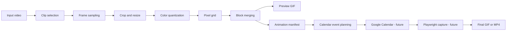

# destiny-calendar-animation

> Development status: local MVP, guarded Calendar calibration, and a single-frame Calendar mapper. Multi-frame upload and browser capture remain deliberately disabled.

`destiny-calendar-animation` turns a local video clip into a small, palette-limited pixel animation, a preview GIF, and a versioned JSON manifest. The manifest is suitable for safely planning a future experiment in which each frame is represented by one week of real Google Calendar events. The processor is generic; no Destiny assets are distributed here.



## What works

- video inspection for MP4, MOV, MKV, WebM, AVI, and readable GIF files;
- uniform clip sampling without loading the entire video;
- optional crop plus `contain`, `cover`, and `stretch` fitting;
- deterministic grayscale or Calendar-inspired palettes (2–6 colors);
- optional Euclidean background-color removal;
- horizontal runs merged into one block/event estimate;
- PNG frames, enlarged local GIF, source metadata, and schema `1.0` manifest;
- manifest validation and footprint estimates;
- experimental weekly Calendar mapping exported as a local dry-run plan.
- deterministic Calendar calibration patterns with JSON/text/PNG artifacts;
- opt-in OAuth upload of at most 30 calibration events by default to a dedicated lab calendar;
- duplicate-run detection and cleanup filtered by private metadata.
- structured color, position, and horizontal-bar observations with mapper-readiness summary.
- one-frame `contain` fitting, Calendar color mapping, local comparison artifacts, and guarded upload.

## Install

Python 3.12+ and MP4/H.264 input are recommended.

```bash
uv sync --extra dev
uv run calendar-anim --help
```

Compatible `pip` installation:

```bash
python -m venv .venv
# Activate .venv for your shell
python -m pip install -e ".[dev]"
calendar-anim --help
python -m calendar_anim --help
```

## CLI

Inspect metadata:

```bash
calendar-anim inspect input.mp4
```

Typical output includes dimensions, FPS, source-frame count, duration, codec, and warnings. Audio detection is intentionally reported as unavailable because audio is ignored.

Render a clip:

```bash
calendar-anim render input.mp4 \
  --start 0 --duration 2.5 --frames 10 \
  --width 28 --height 32 --colors 4 \
  --palette calendar --background "#000000" \
  --output output/ghost-demo
```

Configuration can come from `--config examples/config.example.yaml`. Precedence is CLI flags, then YAML, then defaults. Crop flags are `--crop-x`, `--crop-y`, `--crop-width`, and `--crop-height`.

Inspect results and create a safe local Calendar plan:

```bash
calendar-anim estimate output/ghost-demo/animation.json
calendar-anim validate output/ghost-demo/animation.json
calendar-anim calendar plan output/ghost-demo/animation.json \
  --start-date 2026-08-10 --timezone America/Sao_Paulo \
  --output output/ghost-demo/calendar-plan.json
```

## Google Calendar calibration

Calibration measures how Google Calendar actually renders short and overlapping events before the experimental mapper is trusted. Dry-run is always the default and does not require credentials:

```bash
calendar-anim calendar calibration-patterns
calendar-anim calendar calibrate \
  --pattern overlap-columns --start-date 2026-08-10
```

The command writes `calibration-plan.json`, `calibration-report.txt`, `expected-layout.png`, and a non-executed `execution-result.json` below `output/calibration/<run_id>/`. The logical PNG is a comparison aid, not a promise of Google's layout.

Real calibration requires Desktop OAuth credentials and explicit execution:

```bash
calendar-anim calendar calibrate \
  --pattern overlap-columns --start-date 2026-08-10 --execute
```

It opens Google's consent flow for manual login, creates or reuses the secondary `Calendar Animation Lab`, checks for the same `run_id`, and asks for confirmation. `--yes` skips only that confirmation; limits and validation remain active. The default limit is 30 and the absolute calibration limit is 100.

Cleanup always requires both identifiers and is dry-run by default:

```bash
calendar-anim calendar cleanup \
  --animation-id calibration-overlap-columns --run-id <run_id>
calendar-anim calendar cleanup \
  --animation-id calibration-overlap-columns --run-id <run_id> --execute
```

The shortest overlap-calibration flow is:

```powershell
python -m calendar_anim calendar calibrate --pattern overlap-columns --start-date 2026-08-10 --run-id overlap-real-01 --execute
python -m calendar_anim calendar record-calibration --run-id overlap-real-01 --pattern overlap-columns --maximum-tested-overlap-columns 6 --usable-overlap-columns 6 --browser-zoom 100 --viewport-width 1920 --viewport-height 1080
python -m calendar_anim calendar calibration-summary
```

The current measured profile records six usable overlap columns per day and therefore derives a candidate `42x24` grid. The local profile separates minimum visible duration from minimum distinguishable height and leaves missing measurements as `pending`. The expected-layout PNG is only a logical reference—not a simulation of Google's layout. See [Google setup](docs/google-calendar-setup.md), [calibration guide](docs/calendar-calibration.md), and [security](docs/calendar-security.md).

The calibration observations extend the local profile without inventing defaults. `calendar calibration-summary` reports each section as pending, incomplete, or recorded and only reports readiness for a single-frame experiment after all five calibration areas have complete measurements.

## Single-frame Calendar mapper

Map exactly one manifest frame without contacting Google:

```powershell
python -m calendar_anim calendar map-frame .\output\primeiro-teste\animation.json --frame 0 --start-date 2026-09-07 --run-id frame-test-001
```

The command reads `output/calibration/calibration-profile.yaml` by default and writes `frame-plan.json`, `mapping-report.txt`, `source-frame.png`, `mapped-preview.png`, and `execution-result.json` below `output/frame-mapping/<run_id>/`. A manifest grid such as `28x20` is fitted with aspect-preserving `contain` into the calibrated candidate grid. Horizontal blocks are expanded into unit cells before fitting, background cells remain absent, and colors are mapped to the nearest calibrated Calendar color with a contrast fallback.

Dry-run remains available while `horizontal-bars` is pending, but real upload is blocked until the profile reports `READY FOR SINGLE-FRAME EXPERIMENT`. An upload additionally requires an explicit date, event-limit validation, confirmation, OAuth, the laboratory calendar, and a unique frame run:

```powershell
python -m calendar_anim calendar map-frame .\output\primeiro-teste\animation.json --frame 0 --start-date 2026-09-07 --run-id frame-test-001 --execute
```

See [single-frame mapper](docs/single-frame-mapper.md) for mapping rules, metrics, limits, cleanup, and current visual constraints.

Every render produces:

```text
output/ghost-demo/
├── animation.json
├── preview.gif
├── source-info.json
└── frames/
    ├── frame_000.png
    └── ...
```

The Pydantic-modeled manifest keeps source selection, render settings, statistics, relative frame paths, and every logical block independent from any vendor API. Currently, one horizontal block estimates one event and one frame occupies one week. This mapping is explicitly experimental.

## Architecture and safety

Video processing, rendering, manifest IO, Calendar planning, and browser capture have separate boundaries. Calibration and single-frame plans are API-independent. `GoogleCalendarGateway` is enabled only after `--execute`; `PlaywrightCaptureGateway` remains disabled.

Calibration access uses local OAuth and a separate calendar. Calibration events carry private `generated_by`, `animation_id`, `run_id`, `pattern`, and `event_index` metadata. Cleanup requires `animation_id` plus `run_id`. The project never automates login or stores passwords. OAuth files, local calendar configuration, browser profiles, input videos, and generated output are ignored by Git.

Playwright will eventually use a separate persistent profile after manual authentication, select weekly view, capture only the calendar region, move one week per frame, and compose screenshots. Individual screenshots are preferred to recording UI transitions.

## Limitations and roadmap

Calendar colors and layout still require manual measurement. Only calibration and one-frame uploads are supported; there is no multi-frame upload, batching/resume, Playwright selector implementation, vertical block merge, or final screenshot composition.

1. **Phase 0 – calibration:** a few static events, useful resolution, event duration, zoom, and window size.
2. **Phase 1 – local MVP:** video, frames, pixelization, GIF, manifest, and estimate (implemented).
3. **Phase 2 – planning:** mapper, dry-run, separate calendar, metadata, and safe cleanup (single-frame experiment implemented).
4. **Phase 3 – live upload:** multi-frame planning, batches, backoff, quotas, and resume.
5. **Phase 4 – capture:** persistent Playwright profile, weekly navigation, stable waits, screenshots, composition.
6. **Phase 5 – longer clips:** around 10 seconds, configurable FPS, scenes, stronger compression and resume.

Clips of 2–5 seconds and 4–8 FPS are initial recommendations, not architectural limits. Cost scales roughly as selected frames × blocks per frame; events do not animate on their own—the final animation is an illusion produced by switching weekly frames.

## Development

```bash
uv run ruff check .
uv run ruff format --check .
uv run mypy
uv run pytest
uv run pytest tests/unit
uv run pytest tests/integration
```

See [architecture](docs/architecture.md), [pipeline](docs/pipeline.md), [Calendar plan](docs/google-calendar-plan.md), [Google setup](docs/google-calendar-setup.md), [calibration](docs/calendar-calibration.md), [single-frame mapper](docs/single-frame-mapper.md), [security](docs/calendar-security.md), and [development](docs/development.md). Released under the MIT License.
