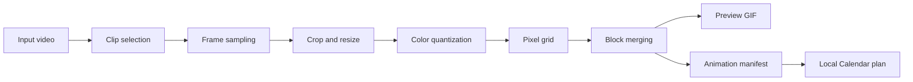

# destiny-calendar-animation

Local-first toolkit for turning a short video into a small pixel-art animation, preview GIF, and versioned manifest. The manifest establishes a vendor-independent boundary for later Calendar experiments; this initial version never contacts Google.



## What works

- video inspection for MP4, MOV, MKV, WebM, AVI, and readable GIF files;
- uniform clip sampling without loading the entire video;
- optional crop and configurable fitting;
- deterministic grayscale or Calendar-inspired palettes;
- optional background-color removal;
- horizontal pixel-run merging;
- PNG frames and enlarged local GIF preview;
- versioned Pydantic manifest;
- validation and event-footprint estimates;
- experimental Calendar event planning exported as local JSON only.

## Install

Python 3.12 or newer is required.

```powershell
python -m venv .venv
.\.venv\Scripts\python.exe -m pip install -e ".[dev]"
```

PowerShell script execution is not required; every command can call the virtual-environment Python directly.

## Basic flow

```powershell
.\.venv\Scripts\python.exe -m calendar_anim inspect .\input.mp4
.\.venv\Scripts\python.exe -m calendar_anim render .\input.mp4 --start 0 --duration 3 --frames 12 --width 28 --height 20 --palette grayscale --colors 4 --background "#000000" --background-tolerance 35 --output-fps 4 --output .\output\first-test
.\.venv\Scripts\python.exe -m calendar_anim validate .\output\first-test\animation.json
.\.venv\Scripts\python.exe -m calendar_anim estimate .\output\first-test\animation.json
```

Create a local Calendar plan without network access:

```powershell
.\.venv\Scripts\python.exe -m calendar_anim calendar plan .\output\first-test\animation.json --start-date 2026-08-10 --timezone America/Sao_Paulo --output .\output\first-test\calendar-plan.json
```

## Architecture

The code is separated by responsibility:

- `video`: source inspection, reading, and sampling;
- `renderer`: palette conversion, pixelization, block merging, and preview;
- `models`: stable manifest contracts;
- `calendar`: vendor-independent event drafts and local dry-run planning;
- `browser`: an interface boundary reserved for future capture work.

Google OAuth, real Calendar writes, browser automation, and full animation upload are intentionally outside this initial commit.

## Development

```powershell
.\.venv\Scripts\python.exe -m ruff check .
.\.venv\Scripts\python.exe -m ruff format --check .
.\.venv\Scripts\python.exe -m mypy src
.\.venv\Scripts\python.exe -m pytest
```

See [the local pipeline documentation](docs/pipeline.md). Released under the MIT License.
